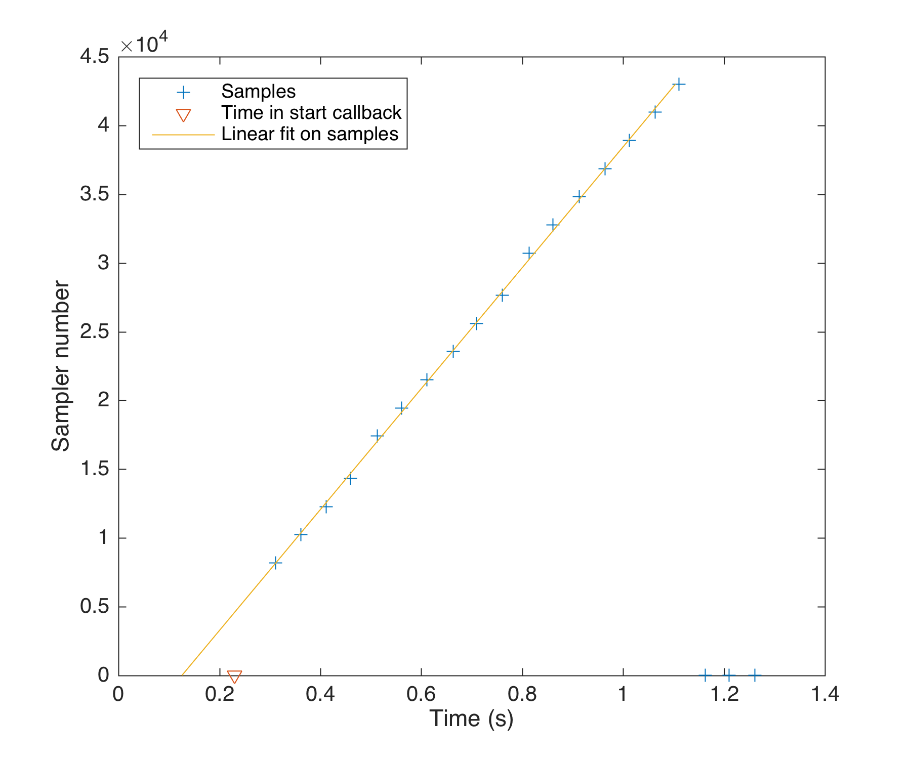
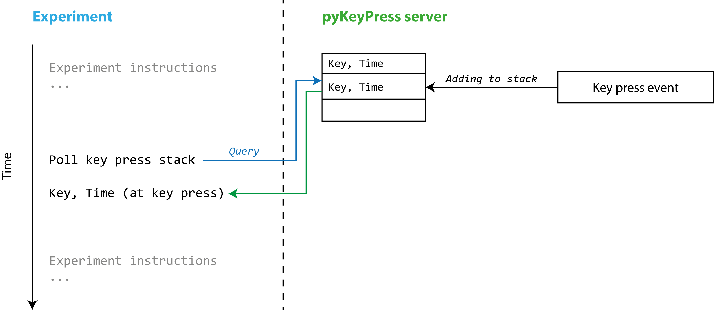
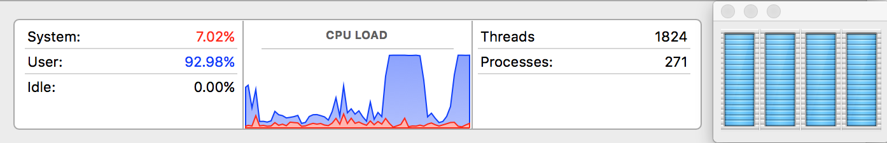
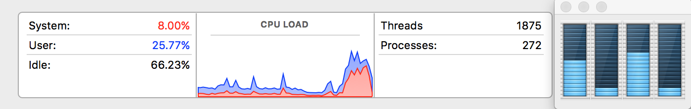
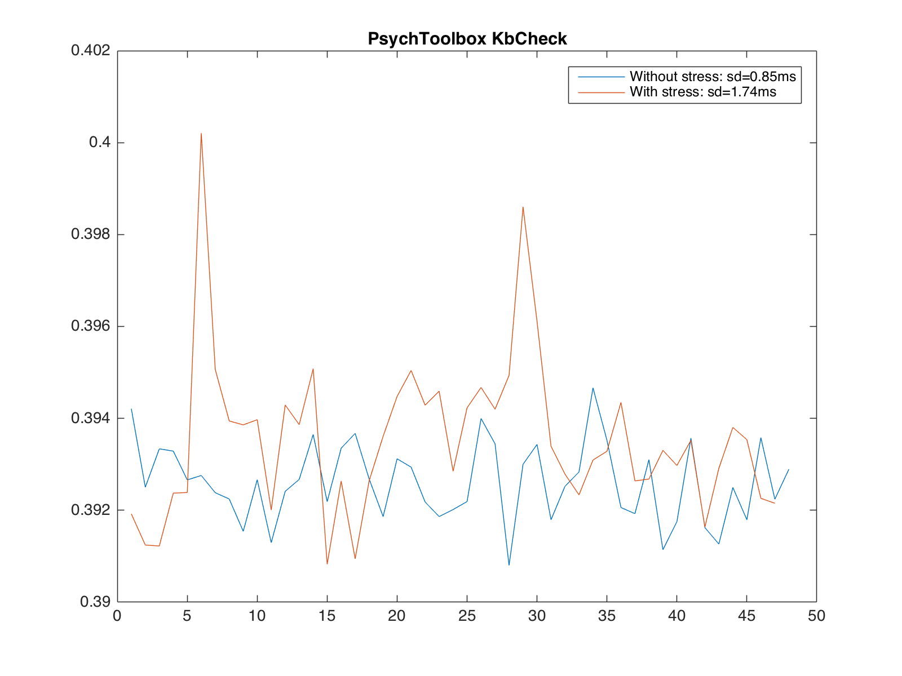
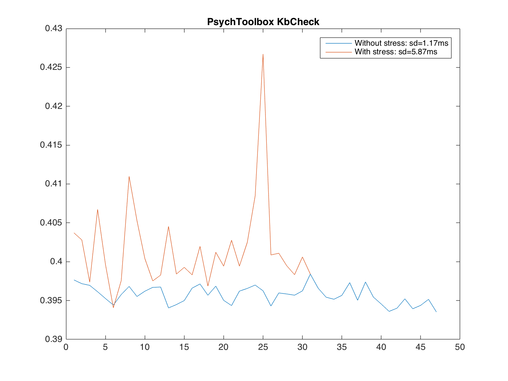
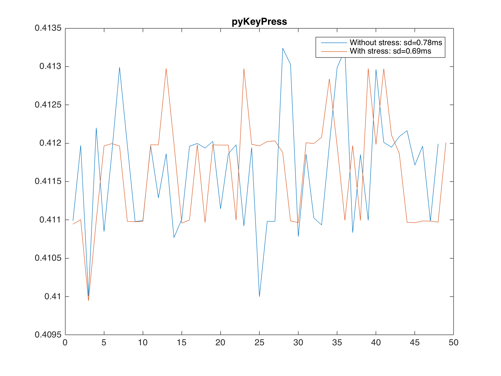
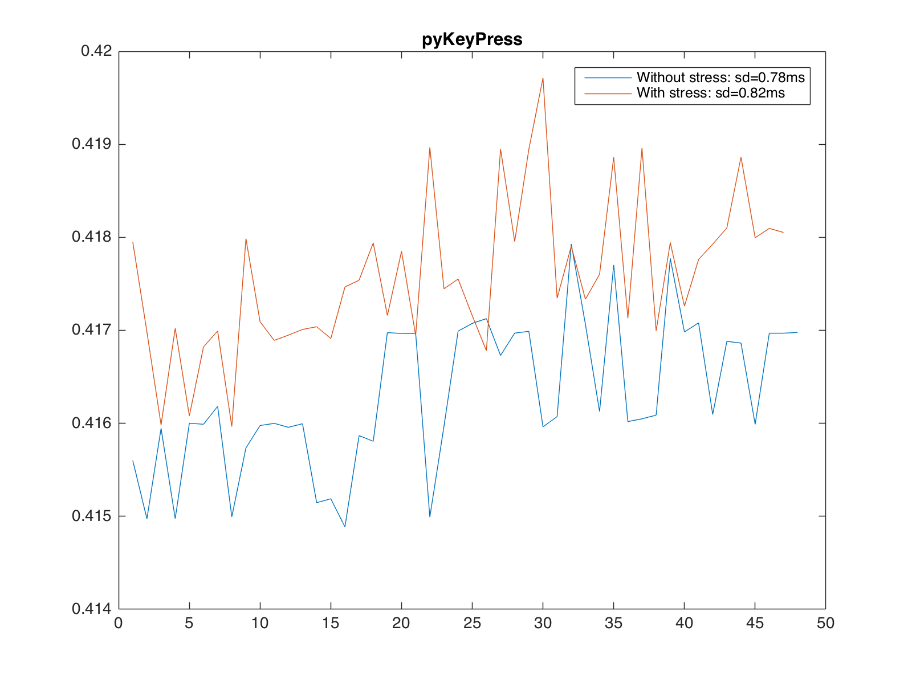

# Review of technical limitations for the measure of response times to auditory stimuli

_2017-04-03_

Etienne Gaudrain <etienne.gaudrain@cnrs.fr><br>
*Lyon Neuroscience Research Center, CNRS UMR5292, Université Lyon 1, Lyon, FR* |
*University of Groningen, University Medical Center Groningen, Groningen, NL*

[TOC]

## Introduction

The response time to an auditory stimulus is the time interval between a reference time attached to the sound (e.g., its onset or offset) and a response given by the participant. Measuring response times accurately requires to be able to mark these events on a common clock. Computers have become very useful for these tasks, but despite the increase in speed of processors, a number of limitations remain. Researchers wishing to use these techniques should be aware of these limitations to be able to establish the resolution of their measurement method. This, in turn, will allow them to design their study adequately and to interpret their results appropriately.

In this report, some of these limitations are explained and estimated using various techniques. Finally, potential solutions are presented. But first, here's a short summary of the findings, for those who don't want to spend the time to read it all.

### The long story short

The key to measuring response times is to know your system. If you are using Matlab to program your experiment, a lot of effort has been put in the version 3.0 of the [Psychtoolbox](http://psychtoolbox.org/) to make time measurements more accurate. (Beware: That wasn't the case with the previous version!) The sound playing facilities provided in [`PsychPortAudio`](http://docs.psychtoolbox.org/PsychPortAudio) and the response time facility provided by [`KbQueueCheck`](https://github.com/Psychtoolbox-3/Psychtoolbox-3/blob/master/Psychtoolbox/PsychBasic/KbQueueCheck.m) ensure an accuracy of about 10 ms. If it can be expected that the response time differences are much larger than that (let's say more than 50 ms), then these functions will be perfectly adequate. For smaller response time differences, however, a different system will have to be used.

### Theoretical considerations

Time measurement systems are affected by two types of limitations: *lag* and *jitter*.

__Lag__ is the fixed latency in noticing an event. All digital systems have buffers that result in latencies. However, in a psychophysical experiment, we typically contrast two conditions, and we are interested in the within-subject difference in response time (RT) across the conditions. If the lag is fixed across conditions, it will thus not affect the results. One pitfall is that, because RT data is by nature non-Gaussian (as it does not, conceptually, allow for negative values), it is common to transform the data (either log-transform, or Poisson-transform) to make it more normal. In that case, if the latency is too important, it might affect this transformation. We must make sure that the basic latency of our measuring system remains negligible relative to the RTs themselves.

__Jitter__ is the variable part of the latency. In other words, this is the noise in the measurements which will directly limit the resolution of the method: is the jitter is too important, it will become impossible to detect small RT differences between conditions.

Lag and jitter occur both when measuring when a sound is effectively played and when measuring when the participant is giving their answer.

## Uncertainty of sound playing time

To play sounds, software must provide successive buffers — small chunk of sounds – to the soundcard. Before the sound can be played, at least one buffer must have been sent. To reduce latency it is thus advisable to reduce the buffer size. However, the software needs to keep feeding buffers to the soundcard. The shorter the buffer, the higher the risk that the software will fail to provide the buffer on time, resulting in a loss of signal. Nowadays, many systems are capable of low-latency as long as the appropriate drivers are used. On Linux (ALSA) and Mac OSX (CoreAudio), the native system drivers are both low-latency-capable. On Windows, the legacy MME driver system is not suitable for low-latency. However, the newer WASAPI system (since Windows Vista) and the ASIO drivers do allow low-latency. Note that latency can also be introduced by subsequent hardware in the presentation chain (e.g. digital-analog converter, propagation time if a loudspeaker is far enough).

In addition to the fix latency, a more serious problem is the jitter in the onset time of the sound. Imagine the following piece of Matlab code:

```matlab
p = audioplayer(x, fs);
t0 = now();
p.play();
t1 = now();
```

The `now()` function returns the current timestamp and the `play()` function starts the playback of the `audioplayer` object and returns "immediately". However, although the function returns right away, the sound does not start playing right away.

### Characterization of the problem

To evaluate the magnitude of the problem, we can use a feature of the Matlab `audioplayer` object which allows us to poll which sample was last played. This feature is useful for instance to display a progress bar while the sound is being played. But we can also use it here to match sample number to system time, to map how the samples are actually played.

This can be done with the following code:

```matlab
function test_lag_audioplayer()

    global time_before_play

    fs = 44100;
    x  = randn(fs,1);

    p = audioplayer(x, fs);
    p.TimerFcn = @timer_callback;
    p.StartFcn = @start_callback;
    p.UserData = struct();
    p.UserData.time_sample = [];

    time_before_play = tic();
    playblocking(p);

    ts = p.UserData.time_sample;
    plot(ts(1,:), ts(2,:), '+');
    hold on
    plot(p.UserData.start_time, 1, 'v')

    ts = ts(:, ts(2,:)>1);

    pl = polyfit(ts(2,:), ts(1,:), 1);

    plot(polyval(pl, [1, max(ts(2,:))]), [1, max(ts(2,:))], '-')
    hold off

    legend({'Samples', 'Time in start callback', 'Linear fit on samples'}, ...
		       'Location', 'northwest');

    xlabel('Time (s)')
    ylabel('Sampler number')

    set(gcf, 'PaperPosition', [0, 0, 6, 5]);
    print(gcf, 'test_lag_audioplayer.png', '-dpng', '-r300');

%-------
function start_callback(obj, event)
    global time_before_play

    obj.UserData.start_time = toc(time_before_play);

%-------
function timer_callback(obj, event)
    global time_before_play

    t = toc(time_before_play);
    s = obj.CurrentSample;

    obj.UserData.time_sample = [obj.UserData.time_sample, [t; s]];
```

The code plays a 1-s noise after setting the `StartFcn` and `TimerFcn` callbacks. Both are set to measure time using the `toc` function relative to a time measured just before `playblocking` was called.


*__Figure 1:__ Timecourse of sample playing, reported start time and extrapolated start time.*

Figure 1 shows the resulting plot. It shows that the sound does not start immediately, and that the time reported in the `StartFcn` callback is too late. Using a linear fit and extrapolating to the first sample, however, it is possible to estimate more accurately the actual onset time. The robustness of the method comes from the fact that we use multiple sample points to estimate the start time.

This method can be implemented in actual experiments to estimate the actual start time.

To estimate how big a problem this is, I also built some histograms over a number of sounds (see Figure 2). The distribution shows that the lag between the call of the `play` function and the actual start of the sound ranges from 120 to almost 200 ms. This jitter thus presents a high risk of blurring RT differences between conditions if it is not controlled for.


*__Figure 2:__ Distribution of onset lags for 100 sounds.*

### Solutions

I already presented one solution, which gives a more accurate estimate of onset time using only the available Matlab objects.

It is also possible to use an external library, like the PsychToolbox 3 (http://psychtoolbox.org/, PTB3). PTB3 has function based on PortAudio (http://www.portaudio.com/) to provide low-latency audio playing capabilities.

The audio device must be initialized and opened:

```matlab
InitializePsychSound();
pahandle = PsychPortAudio('Open', [], [], 2, fs, nchan);
```
An important detail is that when the device is opened, it is possible to request a "latency class". Here I chose 2, meaning "Take full control over the audio device, even if this causes other sound applications to fail or shutdown."

The buffer is then filled with the content of `x`:

```matlab
PsychPortAudio('FillBuffer', pahandle, x);
```

When the sound is started, it returns the actual starting time:

```matlab
start_time = PsychPortAudio('Start', pahandle, 1, 0, 1);
```

See the documentation of [`PsychPortAudio`](http://docs.psychtoolbox.org/PsychPortAudio) for more details.

With this function, I measured a jitter of less than a millisecond and a lag of less than 5 ms. I got similar results with a "latency class" of 1 (the default), but much worse results with a latency class of 0.

The conclusion of these tests is that `PsychPortAudio` is suitable to use as is to play sounds. It offers minimal jitter and sufficiently small latency.

## Measuring subject responses

Four classes of response capture devices can be distinguished. The first class is just a simple keyboard. The second is a standard Human Interface Device (HID): e.g. a joystick or a custom made response box. The third one is a device with an internal clock. The fourth one is a device that can give time relative to an audio trigger.

As far as I am aware only the 3 first classes are readily available commercially. Classes 1 and 2 generally do not require special drivers but may require custom software. The thirds class typically requires specific drivers. The fourth class can be implemented with a Tucker Davis Technologies system or equivalent, or with custom hardware based on a multichannel soundcard.

Here we will focus on class 1, because this is the easiest to implement as far as the hardware is concerned. We will also say just a few words about class 2.

### Common code structure

To measure accurate response times we need to obtain the exact time when a key has been pressed. There are 2 conceptually very different approaches to obtaining the time of a button press. The most common one consists in having a loop that check periodically if a key has been pressed (or is being pressed). The form of the code for this would be, in pseudo-code:

```
while forever
{
	if a key has been pressed
	{
		t = time now
		break
	}
}
```

This implementation, although very simple, presents two problems:

1. __Asynchronous polling__: As we generally use procedural programming when coding our experiments, having a continuously running while loop is rather inconvenient as it prevents any other activity to take place (stop a sound, change the screen display...).
2. __Timestamping key presses__: The time reported is the time we checked whether a key had been pressed rather than the time the key was actually pressed. If for some reason the while loop is slowed down (e.g. in case of overload of the system), the resolution of the time measurement will decrease.

### Asynchronous polling

To solve (1) we want to have a stack where key presses are logged with their timestamps, and then poll the stack to see if a keypress happened since the last time we checked. For that we would prefer to have a system that log keystrokes in the background and timestamp them. There is a very simple test to see if a keystroke detection system is working this way or not. In pseudo-code it looks like this:

```
t0 = time now
generate (virtual) key stroke
t1 = time now
wait 1 s
t2 = get time of last keystroke
```

If the method to return keystrokes is keeping a log of key presses, `t2` should be between `t0` and `t1`. Otherwise, `t2` will be approximately 1 s larger than `t1`.

In Matlab with the PsychToolbox with the `KbCheck` function the test can be implemented as follows:

```matlab
import java.awt.*;
import java.awt.event.*;

rob = Robot;

t0 = GetSecs();
rob.keyPress(KeyEvent.VK_1);
t1 = GetSecs();

pause(1);

[~, t2, k, ~] = KbCheck();
```

This gives a value for `t2` approximately 1 s larger than `t1`, showing that rather than returning the time of the actual keypress, `KbCheck()` returns the time of the function call (as specified in its [documentation](https://github.com/Psychtoolbox-3/Psychtoolbox-3/blob/master/Psychtoolbox/PsychBasic/KbCheck.m)).

However, if one uses the [`KbQueueCheck`](https://github.com/Psychtoolbox-3/Psychtoolbox-3/blob/master/Psychtoolbox/PsychBasic/KbQueueCheck.m) function, it is possible to go back in time and the polling time is now not the keystroke time but the time of the actual keypress.

```matlab
KbQueueCreate();
KbQueueStart();

t0 = GetSecs();

% We use a real key press because robot doesn't work
input('Press a key', 's');

t1 = GetSecs();

pause(1);

[~, t2] = KbQueueCheck();
t2 = min(t2(t2~=0));
KbQueueStop();
```

This is neat but it only gives the time of the first and last keypresses for each key. If a key has been pressed more than twice, the information is lost.

On [Windows](https://github.com/Psychtoolbox-3/Psychtoolbox-3/blob/master/PsychSourceGL/Source/Windows/PsychHID/PsychHIDStandardInterfaces.cpp), the `PsychHIDOSKbQueueStart` function starts a thread that periodically checks the key state with a loop in `KbQueueProcessEvents`. On [Mac OSX](https://github.com/Psychtoolbox-3/Psychtoolbox-3/blob/master/PsychSourceGL/Source/OSX/PsychHID/PsychHIDStandardInterfaces.c), `PsychHIDOSKbQueueStart` directly calls `IOHIDQueueStart` and relies more on system calls, although a custom thread is also ran in the background.

To enable true asynchronous polling, one need to setup a key-logging application that timestamps key-presses as soon as they occur, and store the key event with its timestamp in a stack that can be queried remotely (i.e. without disturbing the course of the key-logging). The `pyKeyPress` Python module is providing this, at the moment for Mac OSX only.


*__Figure 3:__ Structure of asynchronous polling in `pyKeyPress`.*

__Summary__ — We have seen ways to assess whether a keypress detection system is reporting time at polling time or if it is logging the key stroke times. I recommend that this simple test should be performed to check that the functions provided in a toolbox/software do indeed behave like advertised. We have also seen solutions to allow asynchronous polling (`KbQueueCheck` or `pyKeyPress`, which will be further described in the next section). But these only solve the first of the two problems mentioned above. Now let's have a look at the second potential problem.

### Timestamping key presses and resilience to system load

What we want to timestamp are really the key press instants rather than the moments we check whether a key has been pressed. Having a key-logging stack of keypress events helps in that sense, but it still does not guarantee that the time logged in the stack was really that of the key press event itself.

Let's examine the common code structure one more time:

```
while forever
{
	if a key has been pressed
	{
		t = time now
		break
	}
}
```

In a two process system where the experiment is running on one side and the a key-logger is keeping track of keypresses on the other, this loop would run in the key-logger. The weakness in this design reside in the fact that when testing "if a key has been pressed", we can only know if a key has been pressed between now and the previous check. The temporal precision to measure a response time is thus limited by the time it takes to execute the loop.

In normal operation mode, on modern computers, this might be very fast (< 1 ms). However modern computers put a lot of emphasis on multi-tasking. As a result, access to the CPU is shared between all running processes. In other words, the `while` loop can be interrupted at any time to let the place to another process. To avoid this we can design a stress test where we load the CPU with another task and see how the jitter on measured response times is affected, and if so, to what extent.

To perform such a test, we need an external source of key-presses, such as a robot that mechanically pushes a key on a keyboard at a regular interval. On the software side, we monitor keypresses for a certain duration, without load, and then with load. We then calculate the time between two successive keystrokes. The metric we are interested in is the difference in standard deviation between the condition without stress and the condition with stress.

Check [benchmark_2.m](./benchmark_2.m) for a Matlab implementation with `KbCheck` and `pyKeyPress`. To load the system, the following functions were created in Matlab [stress.m](./stress.m):

```matlab
function stress(type, t)

switch type
    case 'cpu'
        nb_cores = feature('numCores');
        for i=1:nb_cores
            system(sprintf('python stress.py cpu %d &', t));
        end
    case 'memory'
        system(sprintf('python stress.py memory %d &', t));
end
```

Which invokes the Python script [stress.py](./stress.py):

```python
import numpy
import time
import argparse
import psutil

parser = argparse.ArgumentParser(
    description='Creates memory or CPU stress.',
    formatter_class=argparse.RawDescriptionHelpFormatter)
parser.add_argument('type', choices=['memory', 'cpu'], default='cpu')
parser.add_argument('duration', default=5., type=float)

args = parser.parse_args()
dt = args.duration
t0 = time.time()

if args.type=='memory':
    N = int(numpy.sqrt(psutil.virtual_memory().available/8))
    print "Creating a matrix with %dx%d elements" % (N,N)
    while time.time()<t0+dt:
        try:
            print "Generating matrix"
            M = numpy.random.rand(N,N).astype('f4')
            # If more load is needed
            #print "Multiplying matrix"
            #M = numpy.dot(M,M)
            #print "Calculating inverse"
            #numpy.linalg.inv(M)
        except:
            pass
    print "Timeout"
else:
    while time.time()<t0+dt:
        print 'yes'
```

Note that these script allow for two types of load possible, available as `'cpu'` and `'memory'`. The `'cpu'` load option runs a simple print command in a loop, in as many threads as there are cores on the machine. This loads to 100% usage of CPU on all cores. However the load is only "user" and does not involve heavy kernel tasks. In other word, this type of load is easily interruptible by another process. We thus expect relatively minor effect of the load on the RT jitter. The second option, `'memory'`, on the other hand, checks how much memory is available and fills it with a random matrix. Doing this operation causes the kernel to move large chunks of memory to swap, which largely increases the system load.


*__Figure 4:__ A screenshot of Mac OSX Activity Monitor during a call to `stress` with the `'cpu'` option. Note that the blue curve (user) is at 100% but the red curve (system) remains low.*


*__Figure 5:__ A screenshot of Mac OSX Activity Monitor during a call to `stress` with the `'memory'` option. Note how the red curve is this time almost as high as the blue one.*

Running the experiment here are the results we obtained.


*__Figure 6:__ Interval between successive keypresses as reported by `KbCheck` without cpu load (blue) and with cpu load (red).*


*__Figure 7:__ Interval between successive keypresses as reported by `KbCheck` without cpu load (blue) and with memory load (red).*

So for the `KbCheck` method, the jitter (as measured by the standard deviation) doubled from 0.85 ms to 1.74 ms when a cpu load was applied, and increased from 1.17 to 5.87 ms when the memory load was applied.

__Summary__ — This illustrates that the loop method is indeed affected by cpu and memory loads. However, in both cases the jitter remains relatively small. So, while it is possible, in theory, that in case of dramatic kernel activity the check loop might hang enough to introduce large delays in measuring — or even miss — keypresses, this situation seems relatively unlikely in practice.

### `pyKeyPress`, a more complete solution

To further reduce the potential problems described above, we created a Python program called `pyKeyPress`. It runs a system-wide key-logging software that can be polled asynchronously through a TCP/IP interface. Matlab functions are provided to do so. On top of being able to log large numbers of keypresses (the default is 1024, but can be expanded to any arbitrary size) with their associated timestamps (unlike `KeyQueueCheck` which only logs the first and last presses), `pyKeyPress` also obtains its timestamps in a different way than the PsychToolbox, at least on Mac OSX (note, there is, at the moment, no Windows or Linux implementation).

Mac OSX Cocoa applications have the ability to create delegates that can monitor system wide activities. Within this framework, it is possible to install a system key-logger. The keypress events captured by the key-logger are already timestamped. In other words, it is not necessary, in this architecture, to check the time at the moment our software becomes aware of the event as the event is provided with a timestamp. I must admit that I was not able to determine how this timestamp is attributed: either by the operating system, or by the hardware (if that is even possible). The latter would render these timestamps entirely immune to momentary system load.

To evaluate this, I ran the same stress test as with `KbCheck`. The results are presented below.


*__Figure 8:__ Interval between successive keypresses as reported by `pyKeyPress` without cpu load (blue) and with memory load (red).*


*__Figure 9:__ Interval between successive keypresses as reported by `pyKeyPress` without memory load (blue) and with memory load (red).*

The method shows perfect resilience to the cpu stress test (Figure 8), as well as to the memory stress test (Figure 9). While this is no proof that the event timestamps are coming from the hardware, it is at least an indication that they come from a more reliable process than the one used with `KbCheck`.

The downside of the program is that it requires the installation of a recent version of XCode as well as some Python packages (`pyobjc` 3.0.4), which can prove somewhat challenging in some instances.

## Conclusion

Although response time measurements are attractive because of their apparent methodological simplicity, obtaining accurate measurements requires careful study and testing of the software and hardware involved. Before using these methods, we recommend to run three tests (actual playing time, asynchronous polling and stress) to determine the lag and jitter of the measures.

Applying these tests to the PsychtoolBox, we found that it gives a cumulative (for sound play _and_ keypress detection) jitter of 1 to 2 ms under ideal conditions, but that this jitter could approach 10 ms in extreme load conditions. `pyKeyPress` not only simplifies the coding of the experiment, but also seems more resilient to stress. However, the observed gain is relatively small compared to the typical effect size we are after in pyschoacoustic experiments. We thus recommend to use this `pyKeyPress` only if its implementation and installation are simple enough.

Finally, there is another approach that involves using a multichannel soundcard on which a trigger is sent, synchronized with the stimulus, and re-recorded at the input of the soundcard along with the mechanical response of the subject. Implementing such a solution would however require the ability to detect onsets, in near real time, which could prove challenging.


